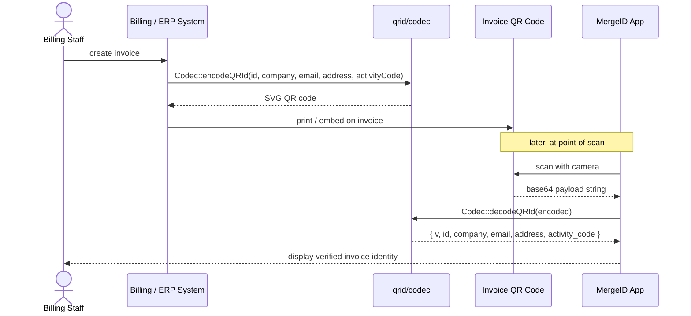

# qrid/codec — PHP

PHP library for encoding and decoding **MergeID electronic invoice QR codes**.

MergeID QR codes embed invoice identity information (company, tax ID, contact, address) as a base64-encoded JSON payload. This library handles the encode/decode round-trip and, optionally, SVG QR image generation.

## Typical usage flow



## Installation

```bash
# Decode only (no extra dependencies)
composer require qrid/codec

# Decode + encode SVG (adds QR generation library)
composer require qrid/codec chillerlan/php-qrcode
```

## Usage

### Decode

Pass the raw string value scanned from a QR code:

```php
use QRId\Codec;

$payload = Codec::decodeQRId($encoded);

echo $payload['v'];             // Payload schema version (int, currently 1)
echo $payload['id'];            // Tax or company ID              (e.g. "3101679980")
echo $payload['company'];       // Company legal name
echo $payload['email'];         // Billing e-mail address
echo $payload['address'];       // Physical address
echo $payload['activity_code']; // Installation / activity code (e.g. "ACT-001"), or "" if blank
```

`decodeQRId` trims surrounding whitespace from the input before decoding, so strings
copied with accidental padding are handled transparently.

**Exceptions thrown:**

| Exception | Cause |
| --- | --- |
| `InvalidArgumentException` | Input is not valid base64 |
| `JsonException` | Decoded bytes are not valid JSON |

```php
use InvalidArgumentException;
use JsonException;
use QRId\Codec;

try {
    $payload = Codec::decodeQRId($raw);
} catch (InvalidArgumentException $e) {
    // QR data was not base64
} catch (JsonException $e) {
    // QR data decoded but was not the expected JSON structure
}
```

### Encode (requires `chillerlan/php-qrcode`)

Produce an SVG QR code from invoice identity fields:

```php
use QRId\Codec;

$svg = Codec::encodeQRId(
    id:           '3101679980',
    company:      'Acme Corp S.A.',
    email:        'billing@acme.example',
    address:      '123 Main St, San José, Costa Rica',
    activityCode: 'ACT-001',
);

// Serve inline
header('Content-Type: image/svg+xml');
echo $svg;

// Or embed in HTML
echo '';
```

`activityCode` is optional and defaults to `''` (blank). A blank activity code signals a
consuming system to generate an electronic ticket instead of using an activity code.

**Exceptions thrown:**

| Exception | Cause |
| --- | --- |
| `RuntimeException` | `chillerlan/php-qrcode` is not installed |
| `JsonException` | JSON encoding of the payload failed (should not occur in practice) |

## Payload format

The QR code data is a UTF-8 JSON object encoded as standard base64 (no line-breaks):

```json
{
  "v": 1,
  "id": "3101679980",
  "company": "Acme Corp S.A.",
  "email": "billing@acme.example",
  "address": "123 Main St, San José, Costa Rica",
  "activity_code": "ACT-001"
}
```

| Field | Type | Description |
| --- | --- | --- |
| `v` | `int` | Payload schema version. Currently always `1`. |
| `id` | `string` | Tax / company registration ID. |
| `company` | `string` | Legal company name (UTF-8, including accented characters). |
| `email` | `string` | Primary billing or contact e-mail address. |
| `address` | `string` | Physical address of the company. |
| `activity_code` | `string` | Installation or activity code that links the QR to an internal record. May be blank (`""`), which signals a consuming system to generate an electronic ticket instead. |

## Requirements

| Dependency | Version | Required for |
| --- | --- | --- |
| PHP | `>= 8.1` | Always |
| `chillerlan/php-qrcode` | `^5.0` | `encodeQRId()` only |

## Running tests

```bash
composer install
composer test
```

Tests cover field decoding, UTF-8 handling, whitespace trimming, error paths, and (when `chillerlan/php-qrcode` is available) the full encode-decode round-trip.

## Publishing

New versions reach [Packagist](https://packagist.org/packages/qrid/codec) automatically — there is no build/upload step:

1. Bump the version in the `VERSION` file (repo root) and merge to `main`.
2. [`release.yml`](.github/workflows/release.yml) runs on every push to `main`. It reads `VERSION`; if no `vX.Y.Z` tag already exists for it, it runs PHPUnit across PHP 8.2–8.4 (PHPUnit 11's minimum, even though the library itself supports PHP >= 8.1) and creates that tag plus a GitHub Release.
3. Packagist's webhook on this repository picks up the new tag and republishes it within moments. Composer installs straight from the tagged GitHub source (via `dist`/zipball), so — unlike PyPI or npm — there's no artifact to build/upload and no OIDC/trusted-publisher concept to configure.

`composer.json` intentionally has no `version` field: Composer/Packagist derive the version purely from git tags, and a hardcoded field risks drifting out of sync with the actual tag. `VERSION` exists only so the release workflow has something to read.

Pushes to `main` that don't change `VERSION` are a no-op (the tag already exists), so unrelated commits (docs, CI tweaks) don't trigger a release.

## License

MIT
